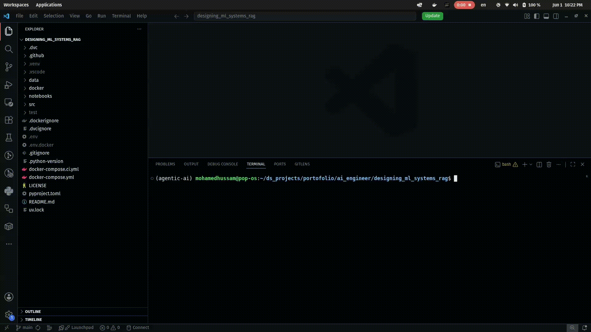

# 📚 Designing ML Systems RAG

A production-style **Retrieval-Augmented Generation (RAG) system** built on top of *Designing Machine Learning Systems* PDF, combining:

* FastAPI backend
* Gradio UI
* Chroma vector database
* Ollama LLM inference
* Structured PDF parsing + metadata-aware chunking
* Dockerized multi-service architecture

---

# 🚀 Demo

<a href="https://github.com/mhusam792/designing_ml_systems_rag/blob/main/assets/demo.mp4">
  
</a>

---

# 🧠 System Architecture

The system follows a modular RAG pipeline:

```
PDF → Structure Parsing → Chunking → Embeddings → Chroma DB
                                                ↓
User Query → FastAPI → Retriever → LLM (Ollama) → Answer + Sources
                                                ↓
                                            Gradio UI
```

---

# ⚙️ Features

## 📄 Document Processing

* PDF outline extraction using `PyPDF`
* Hierarchical structure parsing (chapter / section / subsection)
* Metadata enrichment for each chunk

## ✂️ Chunking Strategy

* Recursive text splitting
* Structure-aware chunk enrichment
* Page-level context preservation

## 🔎 Retrieval System

* Chroma vector database
* HuggingFace embeddings (`all-MiniLM-L6-v2`)
* Top-K semantic search

## 🤖 LLM Layer

* Powered by **Ollama**
* Supports local models (e.g. `llama3.2:3b`)
* Context-grounded prompting (no hallucination design)

## 🌐 APIs

* FastAPI REST endpoint
* `/query` for question answering
* `/health` for service monitoring

## 🎨 UI

* Gradio chat interface
* Real-time question answering
* Source attribution (chapter + section)

---

# 🧱 Tech Stack

* Python 3.13
* FastAPI
* Gradio
* LangChain
* ChromaDB
* HuggingFace Embeddings
* Ollama
* Docker & Docker Compose

---

# 🐳 Running with Docker

## 1️⃣ Clone repository

```bash
git clone https://github.com/your-username/designing_ml_systems_rag.git
cd designing_ml_systems_rag
```

---

## 2️⃣ Run services

```bash
docker compose up --build
```

---

## 3️⃣ Access services

| Service   | URL                                            |
| --------- | ---------------------------------------------- |
| FastAPI   | [http://localhost:8000](http://localhost:8000) |
| Gradio UI | [http://localhost:7861](http://localhost:7861) |

---

# 📡 API Usage

## 🔹 Health Check

```bash
GET /health
```

Response:

```json
{ "status": "healthy" }
```

---

## 🔹 Query Endpoint

```bash
POST /query
```

### Request:

```json
{
  "question": "What is the phases of designing machine learning system?"
}
```

### Response:

```json
{
  "answer": "...",
  "sources": [
    {
      "chapter": "...",
      "section": "...",
      "page": 12,
      "hierarchy": "..."
    }
  ]
}
```

---

# 🧪 RAG Pipeline Flow

1. Load PDF
2. Extract document structure
3. Split into chunks
4. Enrich chunks with metadata
5. Embed using HuggingFace model
6. Store in Chroma DB
7. Retrieve top-k relevant chunks
8. Generate answer using LLM (Ollama)
9. Return answer + sources

---

# 🐳 Docker Architecture

* `fastapi` → API layer
* `gradio` → UI layer
* `ollama` → LLM inference engine
* `chroma volume` → persistent vector DB

---

# 📦 Environment Variables

Example `.env`:

```env
OLLAMA_BASE_URL=http://ollama:11434
GRADIO_API_URL=http://fastapi:8000/query
```

---

# 🧠 Key Design Decisions

* Metadata-aware chunking improves retrieval accuracy
* Separation of API / UI / LLM layers
* Local-first LLM (Ollama) for privacy & offline use
* Dockerized architecture for reproducibility

---

# 📌 Future Improvements

* [ ] CI/CD with GitHub Actions
* [ ] Evaluation metrics for RAG (faithfulness, relevance)
* [ ] Multi-document support
* [ ] Streaming responses
* [ ] Kubernetes deployment
* [ ] Caching embeddings pipeline

---

# 👨‍💻 Author

**Mohamed Hussam**
AI/ML Engineer

---

# ⭐ If you like this project

Give it a ⭐ on GitHub and feel free to fork it.
